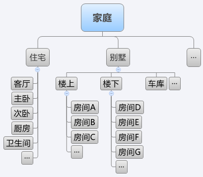
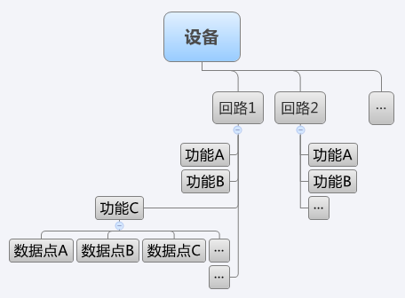
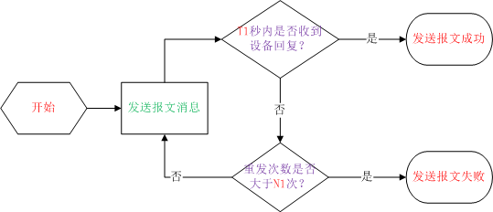
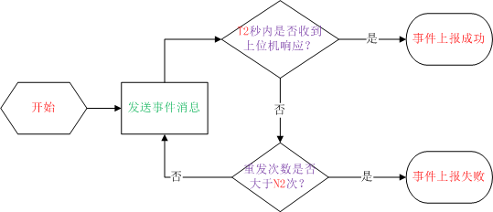
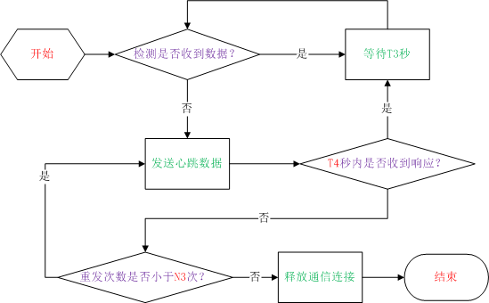
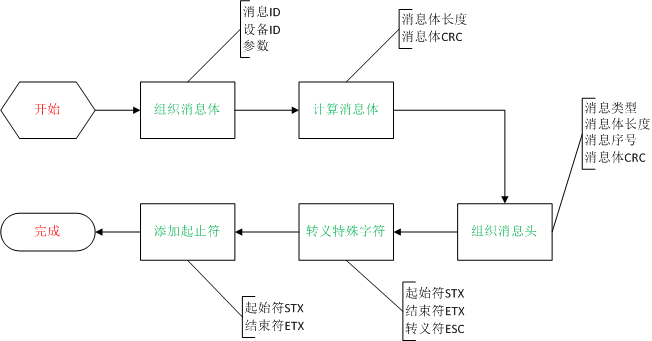
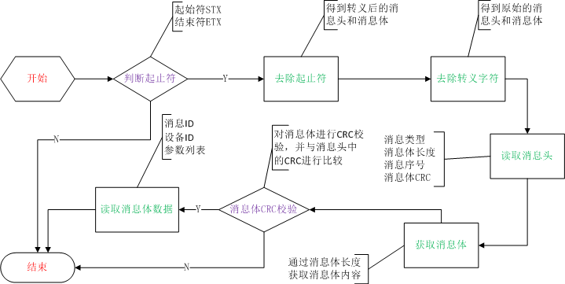

# AirHome 智能控制系统通信协议的实现 #

## 项目概述 ##

&emsp;&emsp;本项目是一个采用C#语言实现的智能家居控制系统通信协议。其适用于智能控制系统中智能设备模块（如WIFI、ZigBee、蓝牙和红外等）与远程服务器或本地智能设备（如手机、平板电脑、PC等）之间进行数据透明传输，协议定义了消息的功能和通信报文格式。

### 建议 ###

1. 为了数据的一致性，每条消息都需要进行回复，即有控制就有反馈、有请求就有响应。
2. 在通信方式上终端模块与服务器采用TCP连接，而本地APP或PC端软件控制采用UDP通信。

### 约定 ###

1. 协议中所有编码方式采用[UTF-8](http://zh.wikipedia.org/zh/UTF-8)（8-bit Unicode Transformation Format）可变长度字符编码。
2. 所有报文数据中的十六进制字符串均使用**大写**形式，即除0~9外，其他字母使用A~F的大写形式。
3. 消息头定义中的“消息体长度”**不包括**自定义转义字符ESC的长度，同时[CRC](http://en.wikipedia.org/wiki/Cyclic_redundancy_check)也**不会对**自定义转义字符ESC进行校验，而是对原字符进行校验，这与消息生成和解析的步骤有关。
4. 由于存在转义字符的原因，相关字节长度会有相应的增加。如灯具色温调节代码0X1002由原来的2个字节变3个字节的0X101BE7，解析时请先替换回原字符。
5. 对于灯具设备，如果有亮度调节、色温调节或[RGB](http://en.wikipedia.org/wiki/RGB_color_model)调节等功能，执行这些功能时将会使用继电器（如果有的话）自动打开。
6. 为了实现灯具设备状态的记忆功能，同时区别**最小亮度调节**与**关闭灯具设备**功能，约定1%为最小的调光等级，具体实现效果由灯具设备决定。

### 定义 ###

1. **设备ID**：设备ID有时也称为UID，每个通信模块出厂时可以人为给定一个编号并烧录到模块中，作为通信模块的唯一标识符。
2. **通道编号**：如果一个设备ID所对应的模块可以控制多个子设备，那么每个子设备通过一个通道编号来标识。需要注意的时，每个子设备可能拥有不同的功能，具体的功能将会在搜索设备时由底层（终端执行控制设备）反馈给上层（服务器或APP等）。
3. **消息类型**：用于表示报文传输的方向和类型，目前支持以下四种，即服务器或APP客户端到终端设备、终端设备到服务器或APP客户端、终端设备主动上报到服务器或APP客户端，以及服务器或APP客户端响应终端设备的上报中告警。
4. **消息ID**：它是一个功能消息的唯一标识。如果一个消息ID为0X0000，那么该消息可能具有多个功能。
5. **消息参数**：由参数类型、参数值长度和参数值组成。此参数可以根据所需功能无限扩展。
6. **设备功能**：即是每个设备（或子设备）所具有的功能，将来可以通过功能代码继续扩展。

### 缩写 ###

1. **STX**：通讯专用字符即文始字符，其全称为Start Of Text，ASCII码值为0X02，它标志着传送正文（数据块）的开始。
2. **ETX**：通讯专用字符即文终字符，其全称为End Of Text，ASCII码值为0X03，它标志着一个数据块的结束。
3. **ESC**：Escape的简写，也称转码字符，ASCII码值为0X1B，本文用于对数据帧起始符和结束符之间出现的STX、ETX以及自身ESC的转义。
4. **CRC**：循环冗余校验（Cyclic Redundancy Check），它是一种常用的差错校验码，用于确保数据传输的正确性和完整性。本文使用的是CRC16查表算法。

## 分区及功能 ##

&emsp;&emsp;每个家庭单元可能拥有一个住所，也有可以拥有多个不同的住所，如一个常住的住所和一个用于度假的别墅。这些依据住所之间可能相距很远，但他们都属于同一个家庭。每个住所由多个房间组成，这些房间可能还会分上下楼，具体的分区由用户自己决定，每个家庭的房间也有所不同。

### 分区层级 ###

1. **家庭**作为整个分组的根， 其包含一个或多个住所。
2. **住宅**是包含一个或多个区域的住所，一个家庭可能拥有多个住所，例如一个主要的住宅和一个度假的别墅。一般而言，一个家庭至少包含一个住所，这个住所也可以不在同一个地方，但在逻辑上它是一体的。
3. **区域**是房间和场所的集合，比如“楼上”、“楼下”和“车库”等。每个住所包含一个或多个区域、每个区域由一个或多个房间或场所组成。
4. **房间**是分区的最小单位，每个住所包含一个或多个房间。

### 功能结构 ###

1. **设备**：此处的设备即为智能产品，其拥有一个或多个通道，具有一个或多个功能，支持WiFi或蓝牙等通信方式进行连接。
2. **通道**：通道也称为回路，每个通道对应一个“子设备”，并可能拥有不同的功能。例如一个智能设备中可能由灯具、摄像头、电机和各种传感器等组成，要想只通过一个WIFI模块控制这些“子设备”，就必须分多路进行操作，而且每一路均有自己的功能特点和控制方式。回路也称为通道，一个回路对应一个“子设备”，如果回路编号为0X00，表示所有回路。
3. **功能**：设备拥有的功能是由设备特性所决定的，例如灯具产品可能拥有开关、亮度调节、色温调节、色彩调节和模式切换等功能，而空调可以进行开关、温度调节以及各种模式切换等。
4. **数据点**：数据点是对功能的细化，每个功能对应一个或多个数据点。例如开关功能对应一个开或关状态的数据点，亮度调节功能对应该一个亮度值数据点；而色温调节功能需要冷色温值和暖色温值两个数据点来实现；色彩调节功能需要红光、绿色和蓝光三个数据点才能实现。

### 设备功能 ###

1. **配置功能**：配置功能用于对设备的信息进行设置操作，如搜索设备、定位设备、设备分组、设置设备名称、设置备注信息、设置定时任务时间、同步时间和恢复出厂设置等。
2. **控制功能**：控制操作会改变设备的工作状态，如电气参数、物理状态等，灯具常用的控制操作如打开或关闭、调节灯具亮度、调节灯具色温、调节灯具RGB等。
3. **数据采集**：为了查看设备当前的运行状态，可以使用数据采集命令到获取，灯具常用的状态包括开关、亮度、色温和RGB等；同时也可以使用该命令来获取设备分组、名称以及备注等信息。
4. **主动请求**：设备根据预先设置的地址主动进行请求，如上电后自动登录到服务器以及定时向服务器发送心跳包等。
5. **事件上报**：当设备检测到事件报警或设备的某此参数超过设定的阈值时，就会触发事件上报。该功能可能需要相关传感器的支持。
6. **数据点功能**：数据点功能是相关功能的细化，它可以用于扩展新功能。

## 通信流程 ##

### 消息下发与回复流程 ###

&emsp;&emsp;服务器或APP客户端向终端设备发送报文消息，终端设备在一定时间内收到该消息后应返回相关的报文消息作为回复。  
&emsp;&emsp;若服务器或APP客户端在T1秒时间内收到终端设备回复的报文消息，那么说明消息发送成功；但如果服务器或APP客户端在该时间内未收到终端设备的回复消息，将重新发送该报文消息。  
&emsp;&emsp;若重发N1次后服务器或APP客户端仍然没有收到终端设备的回复消息，那么将认为报文消息发送失败。其中时间间隔T1和重发次数N1都是可配置的参数，该参数由服务器或APP客户端配置到终端设备进行保存；T1推荐值为5秒，N1推荐值为2次。

### 事件上报与响应流程 ###

&emsp;&emsp;当终端设备某一参数达到阈值或传感器触发报警，就是主动上报事件告警，服务器或APP客户端收到事件消息后，会在一定时间内做出响应。  
&emsp;&emsp;如果终端设备在T2秒内收到了来自服务器或APP客户端的响应消息，则认为事件告警上报成功；与消息下发流程类似，如果终端设备在该时间内没有收到来自上层的响应消息，那么终端设备应该重新发送事件上报消息。  
&emsp;&emsp;在重新发送事件上报消息之前，应该判断消息重发次数是否大于N2次。若重发次数已经大于该次数，则认为事件上报消息发送失败。其中时间间隔T2和重发次数N2都是可配置的参数，该参数由服务器或APP客户端自动保存；T2推荐值为5秒，N2推荐值为2次。

### 心跳包处理流程 ###
&emsp;&emsp;终端设备在与远程服务器通信时，为了确保双方相互知道对方的在线状态，采用相互发送心跳包的方式来解决。例如在服务器端，可能需要开启一个线程来检测是否有新的数据发送过来，如果检测到通信链路收到数据，那么在待T3秒后会再次检测是否收到数据；如果没有检测到通信链路收到数据，服务器就会向终端设备发送一个心跳数据。  
&emsp;&emsp;心跳数据发出之后，服务器会等待T4秒钟，看是否收到终端设备的响应。如果此间服务器收到了终端设备的响应，则继续等待T3秒，然后再次检测是否收到新数据。当然，如果T4秒之后仍然没有收到终端设备的响应，那么服务器将重新发送心跳数据。  
&emsp;&emsp;若重发心跳数据重发N3次后还是未收到终端设备的响应，则应该认为终端设备已经离线，此时应释放与此终端设备的通信连接。上述提到的等待时间T3、时间间隔T4和重发次数N3都应该是可配置的参数，该参数在服务器、APP客户端和终端设备都需要保存；T3推荐值为100秒，T4推荐值为5秒，N3推荐值为3次。

## 报文格式 ##

&emsp;&emsp;为了生成和解析消息具有一致性，并且方便后续扩展新的功能，所有消息数据均采用十六进制形式表示，所有功能指令均进行参数化处理。

### 消息格式定义 ###

&emsp;&emsp;消息报文格式的定义由起始符、消息头、消息体和结束符组成，其具体长度随消息体长度的改变而变化。

<table style="border-collapse: collapse; text-align: center;">
<tr><th></th><th>起始符</th><th>消息头</th><th>消息体</th><th>结束符</th></tr>
<tr><th>表示</th><td>STX</td><td>HEAD</td><td>BODY</td><td>ETX</td></tr>
<tr><th>长度</th><td>1Byte</td><td>12Byte</td><td>可变</td><td>1Byte</td></tr>
<tr><th>取值</th><td>0X02</td><td></td><td></td><td>0X03</td></tr>
</table>

### 转义字符定义 ###

&emsp;&emsp;当数据帧起始符和结束符之间（即消息头和消息体中）出现STX，ETX或ESC时，需要进行转义。

* STX转义为ESC和0XE7，即02->1BE7 
* ETX转义为ESC和0XE8，即03->1BE8 
* ESC转义为ESC和0X00，即1B->1B00

### 消息头定义 ###

&emsp;&emsp;消息头的长度总共有12个字节，依次定义了1个字节的消息类型、2个字节的消息体长度、4个字节的消息序号、3个字节的预留字段和2个字节的消息体CRC校验。

<table style="border-collapse: collapse; text-align: center;">
<tr><th></th><th>消息类型</th><th>消息体长度</th><th>消息序号</th><th>预留</th><th>CRC校验</th></tr>
<tr><th>长度</th><td>1Byte</td><td>2Byte</td><td>4Byte</td><td>3Byte</td><td>2Byte</td></tr>
<tr><th>取值</th><td>00~FF</td><td>0000~FFFF</td><td>00000000~FFFFFFFF</td><td>000000</td><td>0000~FFFF</td></tr>
</table>

**消息类型**：表示消息在设备与服务器或APP之间关系。 
**消息体长度**：可变消息体所占的字节数。 
**消息序号**：取值范围为0~232-1，达到最大值后自动返回从0开始。 
**CRC校验**：对消息体的CRC校验，采用CRC16算法。

### 消息体定义 ###

&emsp;&emsp;消息体定义了消息ID、设备ID和参数列表，其中参数列表由多个参数依次排列，每个参数由参数类型、参数值长度和参数值组成。消息体的长度由参数值长度及参数个数不同而不固定。

<table style="border-collapse: collapse; text-align: center;">
<tr><th rowspan="2"></th><th rowspan="2">消息ID</th><th rowspan="2">设备ID</th><th colspan="4">参数列表</th></tr>
<tr><th>参数1类型</th><th>参数1值长度</th><th>参数1值</th><th>参数2...</th></tr>
<tr><th>长度</th><td>2Byte</td><td>8Byte</td><td>2Byte</td><td>1Byte</td><td>可变</td><td></td></tr>
<tr><th>取值</th><td></td><td></td><td></td><td></td><td></td><td></td></tr>
</table>

**消息ID**：报文消息的代码。 
**设备ID**：用于标识设备唯一性的UID，分配方式待定，如果全为0表示广播。兼容其他厂商时，若超过8个字节，取其低（右边）8个字节；若小于8个字节，左边使用0填充。 
**参数类型**：参数的类型代码。 
**参数值长度**：表示某个参数值的字节数，该值不应超过它的类型规定的最大取值。 
**参数值**：长度可变的字符串十六进制表示。

### 消息类型 ###

<table style="border-collapse: collapse;">
<tr><th>代码</th><th>含义</th><th>备注</th></tr>
<tr><th>0X00</th><td>表示服务器或APP客户端到终端设备 的配置、控制和获取状态操作。</td><td></td></tr>
<tr><th>0X01</th><td>表示终端设备反馈相关信息到服务器 或APP客户端。</td><td>即反馈0X00操作执行的结果。</td></tr>
<tr><th>0X02</th><td>表示终端设备主动请求或上报自己的 状态或告警到服务器或APP客户端。</td><td></td></tr>
<tr><th>0X03</th><td>表示服务器或APP客户端响应终端设 备的状态上报或告警。</td><td>即响应0X1BE7请求或上报 操作执行的结果。</td></tr>
<tr><th>0X04</th><td>预留</td><td></td></tr>
</table>

### 消息ID ###

<table style="border-collapse: collapse;">
<tr><th>代码</th><th>范围</th><th>功能</th><th>备注</th></tr>
<tr><th>0X0000</th><td rowspan="49">配置</td><td></td><td>指令包含多个功能</td></tr>
<tr><th>0X0001</th><td>设置模块或通道分区代码</td><td></td></tr>
<tr><th>0X001BE7</th><td>设置模块或通道分区名称</td><td></td></tr>
<tr><th>0X001BE8</th><td>设置模块或通道名称</td><td></td></tr>
<tr><th>0X0004</th><td>设置模块或通道描述信息</td><td></td></tr>
<tr><th>0X0005</th><td>设置模块或通道图片</td><td>名称或地址</td></tr>
<tr><th>0X0006</th><td>设置模块的时区</td><td>默认为东八区</td></tr>
<tr><th>0X0007</th><td>同步时间到模块中</td><td>需要有时钟功能</td></tr>
<tr><th>0X0008</th><td>设置模块或通道定时任务时段</td><td>如对灯具进行定时打开、关闭 以及调光等，也可以设置触发 报警的时间段。可以只有开始 时间，也可以包含开始时间和 结束时间。若开始时间大于结 束时间，则表示结束时间为第 二天；若包含两个以上的参数， 则表示设置多个时段。</td></tr>
<tr><th>0X0009</th><td></td><td></td></tr>
<tr><th>...</th><td></td><td></td></tr>
<tr><th>0X00B0</th><td>设置串口波特率</td><td></td></tr>
<tr><th>0X00B1</th><td>设置串口数据位</td><td></td></tr>
<tr><th>0X00B2</th><td>设置串口停止位</td><td></td></tr>
<tr><th>0X00B3</th><td>设置串口校验位</td><td></td></tr>
<tr><th>0X00B4</th><td></td><td></td></tr>
<tr><th>...</th><td></td><td></td></tr>
<tr><th>0X00C0</th><td>设置WiFi模块的运行模式</td><td>如User、AP或一键配置模式</td></tr>
<tr><th>0X00C1</th><td>设置模块的SSID，即无线网络名称</td><td>如果模块运行在服务模式，则建 立一个该名称的无线网络；如果 模块运行在客户端模式，则尝试 加入该名称的无线网络</td></tr>
<tr><th>0X00C2</th><td>设置模块的WiFi密码</td><td></td></tr>
<tr><th>0X00C3</th><td>设置模块的IP地址</td><td></td></tr>
<tr><th>0X00C4</th><td>设置模块的网关地址</td><td></td></tr>
<tr><th>0X00C5</th><td>设置模块的子网掩码</td><td></td></tr>
<tr><th>0X00C6</th><td>设置模块的DNS地址</td><td></td></tr>
<tr><th>0X00C7</th><td>设置模块的DHCP功能</td><td></td></tr>
<tr><th>0X00C8</th><td>设置DHCP地址池起始地址</td><td></td></tr>
<tr><th>0X00C9</th><td>设置DHCP地址池结束地址</td><td></td></tr>
<tr><th>0X00CA</th><td>设置模块的MAC地址</td><td>一般不用设置</td></tr>
<tr><th>0X00CB</th><td>设置模块网络协议</td><td></td></tr>
<tr><th>0X00CC</th><td>设置TCP端口</td><td></td></tr>
<tr><th>0X00CD</th><td>设置UDP端口</td><td></td></tr>
<tr><th>0X00CE</th><td>设置HTTP端口</td><td></td></tr>
<tr><th>0X00CF</th><td></td><td></td></tr>
<tr><th>...</th><td></td><td></td></tr>
<tr><th>0X00D0</th><td>设置访问服务器的IP地址</td><td rowspan="2">二者选其中一个</td></tr>
<tr><th>0X00D1</th><td>设置访问服务器的域名</td></tr>
<tr><th>0X00D2</th><td>设置访问服务器的端口</td><td></td></tr>
<tr><th>0X00D3</th><td>设置访问服务器的用户名</td><td></td></tr>
<tr><th>0X00D4</th><td>设置访问服务器的密码</td><td></td></tr>
<tr><th>0X00D5</th><td></td><td></td></tr>
<tr><th>...</th><td></td><td></td></tr>
<tr><th>0X00E0</th><td>设置事件上报等待时间</td><td>T2</td></tr>
<tr><th>0X00E1</th><td>设置事件上报重发次数</td><td>N2</td></tr>
<tr><th>0X00E2</th><td>设置心跳包间隔时间</td><td>T3</td></tr>
<tr><th>0X00E3</th><td>设置心跳包等待时间</td><td>T4</td></tr>
<tr><th>0X00E4</th><td>设置心跳包重发次数</td><td>N3</td></tr>
<tr><th>0X00E5</th><td></td><td></td></tr>
<tr><th>...</th><td></td><td></td></tr>
<tr><th>0X00FF</th><td>恢复出厂设置</td><td>慎用</td></tr>
<tr><th>...</th><td></td><td></td><td></td></tr>
<tr><th>0X0000</th><td rowspan="7">控制</td><td>定位设备或通道</td><td>继电器开关、亮度、颜色、声音 等状态变化来进行定位响应</td></tr>
<tr><th>0X1001</th><td>打开或关闭设备</td><td></td></tr>
<tr><th>0X101BE7</th><td>调节灯具亮度</td><td></td></tr>
<tr><th>0X101BE8</th><td>调节灯具色温</td><td></td></tr>
<tr><th>0X1004</th><td>调节灯具RGB</td><td></td></tr>
<tr><th>0X1005</th><td></td><td></td></tr>
<tr><th>...</th><td></td><td></td></tr>
<tr><th>0X2000</th><td rowspan="23">数据采集</td><td>搜索模块及通道</td><td>设备登录后服务器进行查询</td></tr>
<tr><th>0X2001</th><td>发送心跳包</td><td>服务器向设备</td></tr>
<tr><th>0X201BE7</th><td>获取模块或通道的开关状态</td><td></td></tr>
<tr><th>0X201BE8</th><td>获取模块或通道的亮度</td><td></td></tr>
<tr><th>0X2004</th><td>获取模块或通道的色温</td><td></td></tr>
<tr><th>0X2005</th><td>获取模块或通道的RGB</td><td></td></tr>
<tr><th>0X2006</th><td>获取模块或通道的分区代码</td><td></td></tr>
<tr><th>0X2007</th><td>获取模块或通道的分区名称</td><td></td></tr>
<tr><th>0X2008</th><td>获取模块或通道的名称</td><td></td></tr>
<tr><th>0X2009</th><td>获取模块或通道的备注</td><td></td></tr>
<tr><th>0X200A</th><td>获取模块或通道的图片名称或地址</td><td></td></tr>
<tr><th>0X200B</th><td></td><td></td></tr>
<tr><th>...</th><td></td><td></td></tr>
<tr><th>0X20C0</th><td>获取设备通信类型</td><td>如WIFI、GPRS、3G、4G、 ZigBee、蓝牙和红外等</td></tr>
<tr><th>0X20C1</th><td>获取WiFi模块的运行模式</td><td></td></tr>
<tr><th>0X20C2</th><td>获取SSID无线网络名称和信号强度</td><td>模块本身或接入路由器的 SSID</td></tr>
<tr><th>0X20C3</th><td>获取模块周围无线网络的名称和 信号强度</td><td>可以包括多个无线网络名称 和信号强度</td></tr>
<tr><th>0X20C4</th><td>获取设备的IP地址</td><td></td></tr>
<tr><th>0X20C5</th><td>获取设备的网关地址</td><td></td></tr>
<tr><th>0X20C6</th><td>获取设备的子网掩码</td><td></td></tr>
<tr><th>0X20C7</th><td>获取设备的DNS地址</td><td></td></tr>
<tr><th>0X20C8</th><td>获取设备的MAC地址</td><td></td></tr>
<tr><th>0X20C9</th><td></td><td></td></tr>
<tr><th>...</th><td></td><td></td><td></td></tr>
<tr><th>0X3000</th><td rowspan="5">主动请求</td><td>登录到服务器</td><td>设备到服务器，上电后自动 连接服务器</td></tr>
<tr><th>0X3001</th><td>发送心跳包</td><td>设备向服务器</td></tr>
<tr><th>0X301BE7</th><td></td><td></td></tr>
<tr><th>0X301BE8</th><td></td><td></td></tr>
<tr><th>0X3004</th><td></td><td></td></tr>
<tr><th>...</th><td></td><td></td></tr>
<tr><th>0X4000</th><td rowspan="5">事件上报</td><td></td><td></td></tr>
<tr><th>0X4001</th><td></td><td></td></tr>
<tr><th>0X401BE7</th><td></td><td></td></tr>
<tr><th>0X401BE8</th><td></td><td></td></tr>
<tr><th>0X4004</th><td></td><td></td></tr>
<tr><th>...</th><td></td><td></td><td></td></tr>
<tr><th>0XE000</th><td></td><td>数据点功能</td><td></td></tr>
</table>

### 参数类型 ###

<table style="border-collapse: collapse;">
<tr><th>代码</th><th>取值最 大长度</th><th>含义</th><th>取值</th><th>备注</th></tr>
<tr><th>0X0000</th><td>1Byte</td><td>无参数</td><td>0X00</td><td>用于占位</td></tr>
<tr><th>0X0001</th><td>1Byte</td><td>通道数量</td><td>0X01~0XFF</td><td>表示一个设备中控制模块 所能控制的“子设备”的数 量，每个“子设备”的功能 可能不一样。</td></tr>
<tr><th>0X001BE7</th><td>1Byte</td><td>通道编号</td><td>0X01~0XFF</td><td>表示一个设备中控制模块 所能控制的“子设备”的编号。 0X00表示所有通道。</td></tr>
<tr><th>0X001BE8</th><td>4Byte</td><td>模块或通道分区代码</td><td>0X00000000~ 0XFFFFFFFF</td><td>0X000000表示所有区 第1个Byte预留 第2个Byte表示住宅 第3个Byte表示区域 第4个Byte表示房间</td></tr>
<tr><th>0X0004</th><td>50Byte</td><td>模块或通道分区名称</td><td></td><td></td></tr>
<tr><th>0X0005</th><td>1Byte</td><td>模块及通道功能</td><td></td><td>表示设备具有的功能。 一个功能与一个“子设备” 对应，每个子设备可能有 多个功能。</td></tr>
<tr><th>0X0006</th><td>50Byte</td><td>模块或通道名称</td><td></td><td></td></tr>
<tr><th>0X0007</th><td>100Byte</td><td>模块或通道描述信息</td><td></td><td></td></tr>
<tr><th>0X0008</th><td>100Byte</td><td>模块或通道图片的 名称或地址</td><td></td><td></td></tr>
<tr><th>0X0009</th><td>4Byte</td><td>时区</td><td></td><td>表示方式：±HHmm00 第1个Byte表示时区 &emsp;0X00表示东时区， &emsp;0X01表示西时区 第 2个Byte表示时区小时量 第3个Byte表示时区分钟量 第4个Byte预留 例如0X00080000表示东八区</td></tr>
<tr><th>0X000A</th><td>8Byte</td><td>日期时间</td><td>例如 0X07DE0C04 0B1E0000 表示 2014-12-04 11:30:00</td><td>第1~2个Byte表示年 第3个Byte表示月 第4个Byte表示日 第5个Byte表示小时 第6个Byte表示分钟 第7个Byte表示秒钟 第8个Byte预留</td></tr>
<tr><th>0X000B</th><td>4Byte</td><td>日期时间 （另一种形式）</td><td>0X00000000~ 0XFFFFFFFF</td><td>表示格林威治标准时间 （GMT）1970年1月1日 0时0分0秒到当前时间所 间隔的秒数</td></tr>
<tr><th>0X000C</th><td>2Byte</td><td>时间间隔</td><td>0X0000~ 0XFFFF</td><td>单位为秒</td></tr>
<tr><th>0X000D</th><td>1Byte</td><td>次数</td><td>0X01~0XFF</td><td>一个字节的标量数值</td></tr>
<tr><th>0X000E</th><td></td><td></td><td></td><td></td></tr>
<tr><th>...</th><td></td><td></td><td></td><td></td></tr>
<tr><th>0X00A0</th><td></td><td></td><td></td><td></td></tr>
<tr><th>...</th><td></td><td></td><td></td><td></td></tr>
<tr><th>0X00B0</th><td>3Byte</td><td>波特率</td><td>0X000000~ 0XFFFFFF</td><td></td></tr>
<tr><th>0X00B1</th><td>1Byte</td><td>数据位</td><td>0X05~0X08</td><td></td></tr>
<tr><th>0X00B2</th><td>1Byte</td><td>停止位</td><td>0X00~0X03</td><td>0X00表示None 0X01表示One 0X1BE7表示Two 0X1BE8表示OnePointFive</td></tr>
<tr><th>0X00B3</th><td>1Byte</td><td>校验位</td><td>0X00~0X04</td><td>0X00表示无 0X01表示奇校验 0X1BE7表示偶校验 0X1BE8表示标志校验 0X04表示空检验</td></tr>
<tr><th>0X00B4</th><td></td><td></td><td></td><td></td></tr>
<tr><th>...</th><td></td><td></td><td></td><td></td></tr>
<tr><th>0X00C0</th><td>1Byte</td><td>WiFi模式</td><td>0X00~0XFF</td><td>0X00表示服务器模式 0X01表示客户端模式</td></tr>
<tr><th>0X00C1</th><td>32Byte</td><td>SSID无线网络名称</td><td></td><td></td></tr>
<tr><th>0X00C2</th><td>64Byte</td><td>WiFi密码</td><td></td><td></td></tr>
<tr><th>0X00C3</th><td>1Byte</td><td>加密方式</td><td>0X00~0X07</td><td>0X00表示NONE 0X01表示WEP 0X1BE7表示WPA_TKIP 0X1BE8表示WPA_AES 0X04表示WPA2_TKIP 0X05表示WPA2_AES 0X06表示WPA2_MIXED 0X07表示AUTO</td></tr>
<tr><th>0X00C4</th><td>1Byte</td><td>信号强度</td><td>0X00~0XFF</td><td>只读属性</td></tr>
<tr><th>0X00C5</th><td>15Byte</td><td>模块IP地址</td><td></td><td>如：192.168.1.100</td></tr>
<tr><th>0X00C6</th><td>15Byte</td><td>模块网关地址</td><td></td><td>如：192.168.1.1</td></tr>
<tr><th>0X00C7</th><td>15Byte</td><td>模块子网掩码</td><td></td><td>如：255.255.255.0</td></tr>
<tr><th>0X00C8</th><td>15Byte</td><td>模块DNS地址</td><td></td><td>如：192.168.1.1</td></tr>
<tr><th>0X00C9</th><td>1Byte</td><td>模块是否启用 DHCP模式</td><td></td><td>0X00表示禁用 0X01表示启用 0X1BE7 &emsp;表示创建DHCP服务器</td></tr>
<tr><th>0X00CA</th><td>17Byte</td><td>模块MAC地址</td><td></td><td>如：AA-BB-CC-DD-EE-FF</td></tr>
<tr><th>0X00CB</th><td>1Byte</td><td>网络协议</td><td>0X00~0XFF</td><td>0X01表示TCP 0X00表示UDP 0X1BE7表示HTTP</td></tr>
<tr><th>0X00CC</th><td>2Byte</td><td>TCP端口</td><td>0X0000~ 0XFFFF</td><td></td></tr>
<tr><th>0X00CD</th><td>2Byte</td><td>UDP端口</td><td>0X0000~ 0XFFFF</td><td></td></tr>
<tr><th>0X00CE</th><td>2Byte</td><td>HTTP端口</td><td>0X0000~ 0XFFFF</td><td>默认80</td></tr>
<tr><th>0X00CF</th><td></td><td></td><td></td><td></td></tr>
<tr><th>...</th><td></td><td></td><td></td><td></td></tr>
<tr><th>0X00D0</th><td>15Byte</td><td>服务器IP地址</td><td></td><td></td></tr>
<tr><th>0X00D1</th><td>50Byte</td><td>访问服务器的域名</td><td></td><td></td></tr>
<tr><th>0X00D2</th><td>2Byte</td><td>服务器监听的端口号</td><td>0X0000~ 0XFFFF</td><td></td></tr>
<tr><th>0X00D3</th><td>20Byte</td><td>登录服务器的用户名</td><td></td><td>默认为admin</td></tr>
<tr><th>0X00D4</th><td>32Byte</td><td>登录服务器的密码</td><td></td><td>默认为空。32位MD5加密， 为空时不加密。</td></tr>
<tr><th>0X00D5</th><td></td><td></td><td></td><td></td></tr>
<tr><th>...</th><td></td><td></td><td></td><td></td></tr>
<tr><th>0X1000</th><td>1Byte</td><td>打开或关闭</td><td>0X00、0X01</td><td>0X00表示关 0X01表示开</td></tr>
<tr><th>0X1001</th><td>1Byte</td><td>亮度</td><td>0X01~0XFF</td><td>0X01表示1%亮度 0XFF表示100%亮度</td></tr>
<tr><th>0X101BE7</th><td>1Byte</td><td>冷色温分量</td><td>0X00~0XFF</td><td>&emsp;与灯具设备有关，取值表 示冷色温分量，暖色温分量 由单片机处理。 公式： 冷色温+暖色温=当前亮度 &emsp;此作法是为了使调节色 温时功率（表现为亮度） 不变，同理调节功率（表现 为亮度）时也要求色温不变。</td></tr>
<tr><th>0X101BE8</th><td>4Byte</td><td>RGB</td><td>0X00000000~ 0XFFFFFFFF</td><td>第1个Byte表示红分量 第2个Byte表示绿分量 第3个Byte表示蓝分量 第4个Byte表示白光。 &emsp;00表示暖白，FF表示冷白</td></tr>
<tr><th>0X1004</th><td></td><td></td><td></td><td></td></tr>
<tr><th>...</th><td></td><td></td><td></td><td></td></tr>
<tr><th>0XE000</th><td>1Byte</td><td>布尔类型参数</td><td></td><td></td></tr>
<tr><th>0XE001</th><td>1Byte</td><td>枚举类型参数</td><td></td><td></td></tr>
<tr><th>0XE01BE7</th><td>1Byte</td><td>数字类型参数</td><td></td><td></td></tr>
<tr><th>0XE01BE8</th><td>4Byte</td><td>扩展类型参数</td><td></td><td></td></tr>
<tr><th>0XE004</th><td>100Byte</td><td></td><td></td><td></td></tr>
<tr><th>...</th><td></td><td></td><td></td><td></td></tr>
<tr><th>0XFFFF</th><td>1Byte</td><td>响应码</td><td>0X00~0XFF</td><td>0X00表示成功， 其他代码表示错误。</td></tr>
</table>

### 设备功能 ###

<table style="border-collapse: collapse;">
<tr><th>代码</th><th>含义</th><th>备注</th></tr>
<tr><th>0X00</th><td>具有时钟功能的设备</td><td>拥有定时和同步时间功能</td></tr>
<tr><th>0X01</th><td>支持本地语音控制的设备</td><td rowspan="15">用于扩展的功能，可为上层 APP界面提供数据来源</td></tr>
<tr><th>0X1BE7</th><td>支持电话指令控制的设备</td></tr>
<tr><th>0X1BE8</th><td>支持手机短信控制的设备</td></tr>
<tr><th>0X04</th><td>可随音乐变换场景的设备</td></tr>
<tr><th>0X05</th><td>可随影片变换场景的设备</td></tr>
<tr><th>0X06</th><td>可随图片颜色变换场景的设备</td></tr>
<tr><th>0X07</th><td>支持IFTTT功能的设备</td></tr>
<tr><th>0X08</th><td>支持HomeKit平台的设备</td></tr>
<tr><th>0X09</th><td>支持微信设备功能的设备</td></tr>
<tr><th>0X0A</th><td>支持QQ物联平台的设备</td></tr>
<tr><th>0X0B</th><td>支持阿里智能云物联平台的设备</td></tr>
<tr><th>0X0C</th><td>支持京东微联的设备</td></tr>
<tr><th>0X0D</th><td>支持海尔U+平台的设备</td></tr>
<tr><th>0X0E</th><td></td></tr>
<tr><th>...</th><td></td></tr>
<tr><th>0X20</th><td>支持WPS功能的WIFI设备</td><td></td></tr>
<tr><th>0X21</th><td>支持EasyLink功能的WIFI设备</td><td></td></tr>
<tr><th>0X22</th><td>支持AirKiss功能的WIFI设备</td><td></td></tr>
<tr><th>0X23</th><td>支持AirLink功能的WIFI设备</td><td></td></tr>
<tr><th>0X24</th><td>支持SmartLink功能的WIFI设备</td><td></td></tr>
<tr><th>0X25</th><td>支持AirSync功能的蓝牙设备</td><td></td></tr>
<tr><th>0X26</th><td></td><td></td></tr>
<tr><th>...</th><td></td><td></td></tr>
<tr><th>0X30</th><td>具有开关功能的灯具</td><td>操纵继电器开关</td></tr>
<tr><th>0X34</th><td>具有亮度调节功能的灯具</td><td></td></tr>
<tr><th>0X32</th><td>具有色温调节功能的灯具</td><td></td></tr>
<tr><th>0X33</th><td>具有RGB调节功能的灯具</td><td></td></tr>
<tr><th>0X34</th><td></td><td></td></tr>
<tr><th>...</th><td></td><td></td></tr>
<tr><th>0X40</th><td>具有开关功能的摄像头</td><td>操纵继电器开关</td></tr>
<tr><th>0X41</th><td>具有拍照功能的摄像头</td><td></td></tr>
<tr><th>0X42</th><td>具有录像功能的摄像头</td><td></td></tr>
<tr><th>0X43</th><td>具有远程监控功能的摄像头</td><td></td></tr>
<tr><th>0X44</th><td>具有语音对讲功能的摄像头</td><td></td></tr>
<tr><th>0X45</th><td>具有人脸检测功能的摄像头</td><td></td></tr>
<tr><th>0X46</th><td>具有人脸识别功能的摄像头</td><td></td></tr>
<tr><th>0X47</th><td>具有行为分析功能的摄像头</td><td></td></tr>
<tr><th>0X48</th><td>具有安防功能的摄像头</td><td>设防和撤防功能</td></tr>
<tr><th>0X49</th><td>具有分贝报警功能的摄像头</td><td></td></tr>
<tr><th>0X4A</th><td>具有区域检测功能的摄像头</td><td></td></tr>
<tr><th>0X4B</th><td>具有划界报警功能的摄像头</td><td></td></tr>
<tr><th>0X4C</th><td>具有焦距调节功能的摄像头</td><td></td></tr>
<tr><th>0X4D</th><td>具有云台调节功能的摄像头</td><td></td></tr>
<tr><th>0X4E</th><td></td><td></td></tr>
<tr><th>...</th><td></td><td></td></tr>
<tr><th>0X60</th><td>门锁窗帘</td><td></td></tr>
<tr><th>...</th><td></td><td></td></tr>
<tr><th colspan="3">家电等</th></tr>
<tr><th>0X80</th><td></td><td></td></tr>
<tr><th>...</th><td></td><td></td></tr>
<tr><th colspan="3">传感器类</th></tr>
<tr><th>0XE0</th><td>温度传感器</td><td></td></tr>
<tr><th>0XE1</th><td>湿度传感器</td><td></td></tr>
<tr><th>0XE2</th><td>亮度传感器</td><td></td></tr>
<tr><th>0XE3</th><td>照度传感器</td><td></td></tr>
<tr><th>0XE4</th><td>风速传感器</td><td></td></tr>
<tr><th>0XE5</th><td>PM2.5传感器</td><td></td></tr>
<tr><th>0XE6</th><td>雨水传感器</td><td></td></tr>
<tr><th>0XE7</th><td>烟雾传感器</td><td></td></tr>
<tr><th>0XE8</th><td>有毒气体传感器</td><td></td></tr>
<tr><th>...</th><td></td><td></td></tr>
</table>

### 响应代码 ###

<table style="border-collapse: collapse;">
<tr><th>代码</th><th>描述</th><th>备注</th></tr>
<tr><th>0X00</th><td>成功</td><td></td></tr>
<tr><th>0X01</th><td>命令格式错误</td><td></td></tr>
<tr><th>0X02</th><td>CRC校验错误</td><td></td></tr>
<tr><th>0X03</th><td>不支持该类型的命令</td><td>例如消息类型未定义</td></tr>
<tr><th>0X04</th><td>不支持该操作</td><td>例如消息ID未定义</td></tr>
<tr><th>0X05</th><td>命令无法执行</td><td>例如参数类型未定义</td></tr>
<tr><th>0X06</th><td>参数个数错误</td><td>例如与消息ID所需要对应的参数不一致</td></tr>
<tr><th>0X07</th><td>参数格式错误</td><td>例如参数值长度与参数值的字节数不对应</td></tr>
<tr><th>0X08</th><td></td><td></td></tr>
<tr><th>...</th><td></td><td></td></tr>
<tr><th>0XFF</th><td>未知错误</td><td></td></tr>
</table>

## 消息处理机制 ##

&emsp;&emsp;为了统一消息生成和解析的机制，更好的理解和处理消息体长度、消息体CRC校验以及消息头和消息体中的转义字符，故引入了消息的生成步骤和解析步骤。 
&emsp;&emsp;下面将以调节灯具设备的色温（1002）为例，说明消息生成和解析的步骤。灯具设备的ID为00…00（具体设备ID位数和数值视实际情况而定），调节其通道1（0002 01 01）为偏冷的色温（1002 01 FF）。

&emsp;&emsp;此例中消息类型为00，表明此消息由服务器或APP客户端发送至终端执行设备；消息体长度为0012，即18个字节；消息序号为00000000，表示此消息流水号为0；预留字段建议以全0填充；消息体CRC校验为14CD。

**消息生成步骤**

&emsp;&emsp;若想创建一条消息报文，需要经过以下几个步骤，即组织消息体、计算消息体、组织消息头、转义特殊字符以及添加起止符等。

* 组织消息体

消息体的内容包括消息ID、设备ID和参数列表，参数列表由参数值长度、参数类型和参数值组成，详见第5.4节消息体的定义。

1003 00…00 0002 01 01 1002 01 FF

* 计算消息体

&emsp;&emsp;通过消息的内容可以方便的计算出消息体长度和消息体CRC校验，本例中假设消息长度为0012，消息体CRC校验为14CD

* 组织消息头

&emsp;&emsp;根据实际情况得到消息类型和消息序号，结合上述消息体计算出来的消息体长度和消息体CRC校验，最终得到消息头的内容如下所示：

00 0012 00000000 000000 14CD

* 转义特殊字符

&emsp;&emsp;此步骤是对消息头和消息体中出现的STX、ETX或ESC字符进行转义替换。最终转义后的消息头和消息体的内容如下所示：

00 0012 00000000 000000 14CD

101BE8 00…00 001BE7 01 01 1200 01 FF

* 添加起止符

&emsp;&emsp;最后一步是在消息两端添加起始符和结束符，一条完整的消息报文就创建好了。具体消息报文内容如下所示：

02

00 0012 00000000 000000 14CD

101BE8 00…00 001BE7 01 01 1002 01 FF

03

**消息解析步骤**

&emsp;&emsp;解析消息首先需要通过判断起止符，从而得到一条完整的消息报文；然后去除消息报文两端的起止符，得到转义后的消息头和消息体；再将转义字符替换回原字符，此时就得到了原始的消息头和消息体；再通过读取消息头并获取消息体长度、消息体CRC校验等信息，通过这些信息就可以获取到消息体内容；最后通过对消息体的内容进行CRC校验，并将其与消息头中的CRC校验进行对比，如果两者相同，说明消息有效，进而进行消息体各参数的解析操作。

* 判断起止符

&emsp;&emsp;进行消息解析的第1步是通过判断起始符和结束符，得到一条完整的消息报文内容。完整报文的详细信息如下所示：

02

00 0012 00000000 000000 14CD

101BE8 00…00 001BE7 01 01 1002 01 FF

03

* 去除起止符

&emsp;&emsp;得到完整的消息报文内容之后，第2步就可以去掉消息报文两端的起始符和结束符，获得消息头和消息体组成的内容。内容如下所示：

00 0012 00000000 000000 14CD

101BE8 00…00 001BE7 01 01 1002 01 FF

3. 去除转义字符

&emsp;&emsp;上述消息头和消息体组成的内容包含了特殊字符的转义，需要将其替换回原字符，以便于后继数据的读取。替换回原字符后得到的内容如下所示：

00 0012 00000000 000000 14CD

1003 00…00 0002 01 01 1002 01 FF

* 读取消息头

&emsp;&emsp;由于消息头长度为12个字节，故可以方便地从上述内容中获取消息头的信息；同理消息头中包含的消息类型、消息体长度、消息序号和消息体CRC校验等信息也可以轻松的获取到。消息头的内容如下所示：

00 0012 00000000 000000 14CD

* 获取消息体

&emsp;&emsp;这一步可以通过上述消息头中获取到的消息体长度来获取消息体的内容。消息体的内容具体如下所示：

1003 00…00 0002 01 01 1002 01 FF

* 消息体CRC校验

&emsp;&emsp;将消息体进行CRC校验，并与消息头中的CRC进行比较，如果通过消息体的内容计算出来的CRC数据与消息头中包含的CRC数据一致，说明此消息报文有效，可以进行下一步的数据读取。

* 读取消息体数据

&emsp;&emsp;如果来到了这一步，那说明上述消息报文是有效的，可以读取消息体中的消息ID、设备ID、参数列表等信息，然后通过参数列表解析出参数类型和参数值。

* 处理相关逻辑

&emsp;&emsp;通过上述步骤，已经获得了消息ID、设备ID以及所需的参数列表，接下来就可以进行相应的逻辑操作了，如将数据保存到数据库、执行相关操作、返回相关数据等。
